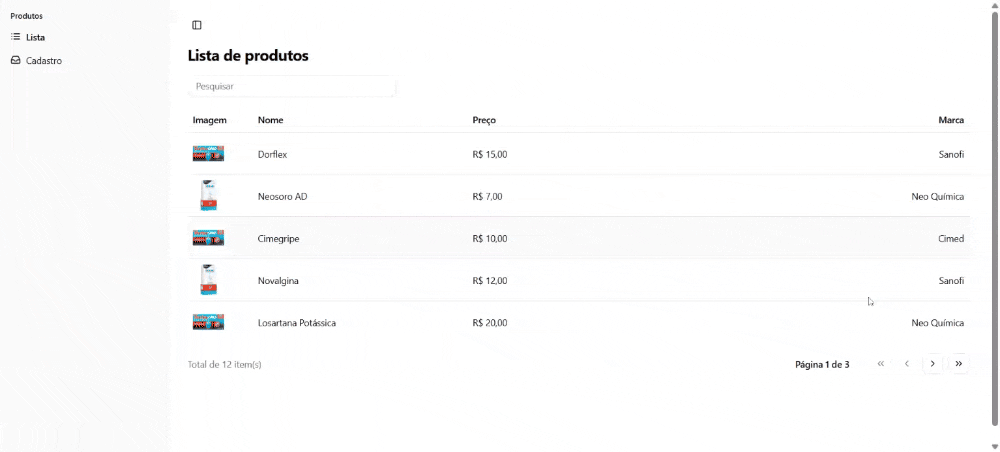
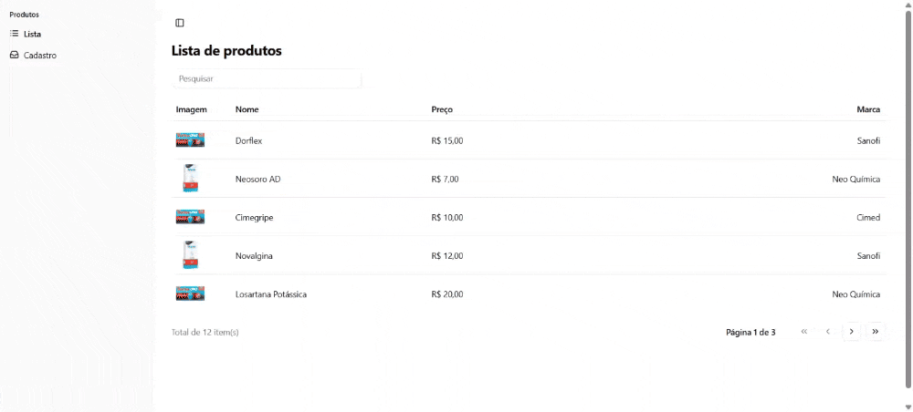
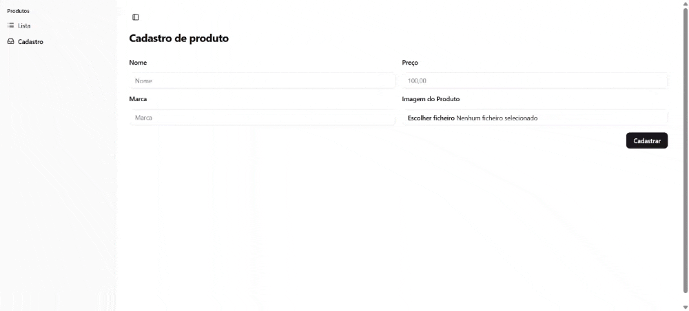

# produtos-digitais

O objetivo desse projeto é um  teste prático.

## Listagem

|Lista de produtos|
|-------|
||

## Cadastro

|Cadastro de produtos |
|-------|
||

## Validação

Layout desenvolvido responsivo.

|Validação do formulário |
|-------|
||

## 🛠️ Abrir e rodar o projeto

Dentro da pasta do projeto execute npm i ou yarn para instalar as dependências, para rodar o projeto, abra o terminal e rode npm run dev  ou yarn dev, o back-end foi criado com json-server, para rodar abra um novo terminal e na raiz do projeto execute `npm run dev:server` ou `yarn dev:server`.